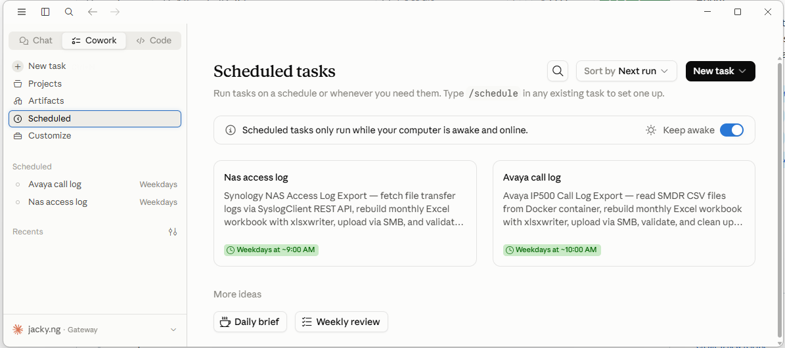

# Autonomous Agent Workflows

> How I use **Claude Code Cowork scheduled tasks** to run agents that do my repetitive morning work unattended — and get better at it over time.

Two daily chores — producing a PBX call-log report and a NAS file-transfer-log report — used to need a person every weekday morning, forever. They're now done by two scheduled agents that run at 9 AM and 10 AM, validate their own output, and remember their mistakes. 60+ unattended runs each.

---

## What it actually does

Two agents, same loop, different data sources:

### Agent 1 — `avaya-call-log` (weekdays 10 AM)

Turns daily PBX call records into a monthly call-log spreadsheet.

```
Every weekday at 10 AM ──▶ agent wakes up (no human)
        │
        │  1. reads SMDR call-record CSVs produced overnight by
        │     a Dockerized PBX receiver (see github.com/jackyngtf/smdr-receiver)
        │  2. rebuilds a monthly Excel workbook from scratch (xlsxwriter)
        │  3. uploads it to a NAS share via SMB
        │  4. re-downloads it to validate (sheet names + row counts match)
        │  5. deletes the now-processed source CSVs
        │  6. writes a structured run report
        ▼
   monthly call-log workbook on the NAS, one worksheet per day
```

- **Input** — a daily SMDR CSV → [`sample-data/smdr-receiver/output/smdr_2026-08-04.csv`](sample-data/smdr-receiver/output/smdr_2026-08-04.csv)
- **Output** — a monthly Excel workbook, one worksheet per day
- **Reference** — [`examples/avaya-call-log/`](examples/avaya-call-log/)

<details>
<summary><b>Why not just use existing call-monitoring software?</b></summary>

Commercial call-monitoring tools are expensive and packed with features (queuing analytics, wallboards) we'd never use for simple in/out logging. [Dave Hope's free SMDR Receiver](https://davehope.co.uk/projects/smdr-receiver/) does exactly this — but it's a Windows `.exe` that needs a PC switched on 24/7, and stores CSVs locally on that machine. So the receiver was rebuilt as a [Docker container](https://github.com/jackyngtf/smdr-receiver) that runs on the NAS itself — no extra machine to keep alive, and the CSVs land right where they're consumed. The agent above then turns those daily CSVs into the monthly workbook, unattended.
</details>

### Agent 2 — `nas-access-log` (weekdays 9 AM)

Turns Synology NAS file-transfer activity into a monthly access-log spreadsheet.

```
Every weekday at 9 AM ──▶ agent wakes up (no human)
        │
        │  1. authenticates to the NAS via REST API
        │  2. fetches file-transfer log records (SyslogClient, logtype=cifs,
        │     1-hour windows) for each missing business day
        │  3. groups records by business day, rebuilds a monthly Excel
        │     workbook from scratch (xlsxwriter)
        │  4. uploads it to the NAS via SMB
        │  5. re-downloads it to validate (sheet names + row counts match)
        │  6. writes a structured run report
        ▼
   monthly access-log workbook on the NAS, one worksheet per business day
```

- **Input** — NAS `cifs` event records → [`sample-data/nas-syslog/nas_access_records_2026-08-04.json`](sample-data/nas-syslog/nas_access_records_2026-08-04.json)
- **Output** — a monthly Excel workbook, one worksheet per business day (consecutive non-working days grouped as `DD-DD`)
- **Reference** — [`examples/nas-access-log/`](examples/nas-access-log/)

<details>
<summary><b>Why not just export the logs from the NAS directly?</b></summary>

Synology's Log Center has a **Logs** tab with a single "Export as HTML/CSV" button — but it dumps *everything*, with no time-range filter. To get one day's file-transfer activity, you'd export the entire log set and sift through it by hand. Setting up a dedicated syslog server just to filter and forward was more infrastructure than the job warranted. So the agent queries the NAS's own REST API (`SyslogClient`, `logtype=cifs`, hourly windows) and pulls exactly the records for each missing business day — then assembles them into the monthly workbook, all unattended.
</details>

### Try the rebuild step yourself

The core of both agents — rebuilding a workbook from scratch with `xlsxwriter` then validating it — is runnable offline right now, no NAS or credentials needed:

```bash
cd sample-data
pip install xlsxwriter openpyxl
python3 rebuild_workbook_demo.py
# → writes AUG_2026_demo.xlsx from the sample SMDR CSV, validates it (13 rows, 32 cols)
```

---

## How it runs: Claude Code Cowork

Both agents are **Scheduled Tasks in Claude Code Cowork** — not cron, not a serverless function. The scheduling layer is what makes this an *agent* rather than a *script*: a scheduled LLM with shell access, pre-approved tools, and no human present.



📖 [`docs/how-it-runs-in-claude-code-cowork.md`](docs/how-it-runs-in-claude-code-cowork.md) — the full write-up: how the three files map onto a Cowork task's fields, why the Instructions box holds `SKILL.md` (not the whole procedure), and how this setup removes the daily chore.

---

## Why this isn't just a script

A plain script does steps 1–6 and stops. These agents **also learn from their own mistakes**:

- Every run appends errors and insights to an append-only archive (`.learnings/`)
- On the next run, when something goes wrong, the agent **greps the archive** and applies the prior fix instead of repeating the failure
- Once a month, the agent **consolidates its own knowledge** — merges duplicates, prunes stale entries, promotes durable rules into the operational procedure

So a failure that cost an hour to diagnose the first time costs seconds every time after.

---

## The three-layer architecture

```
                    ┌─────────────────────────────────────────┐
   Scheduler ─────▶ │  SKILL.md        (entry point)          │
  (daily 9/10 AM)   │  the minimal "how to start" contract    │
                    └────────────────────┬────────────────────┘
                                         │ read in full
                                         ▼
                    ┌─────────────────────────────────────────┐
                    │  WORKINSTRUCTION.md  (operational truth) │
                    │  step-by-step procedure + critical rules │
                    │  THIS is the authoritative ruleset       │
                    └────────────────────┬────────────────────┘
                                         │ consult on errors only
                                         ▼
                    ┌─────────────────────────────────────────┐
                    │  .learnings/       (append-only archive) │
                    │  LEARNINGS.md  ERRORS.md  FEATURE_*.md   │
                    │  grep-only — NEVER read wholesale        │
                    └─────────────────────────────────────────┘
```

| Layer | File | Read when | Written when |
|-------|------|-----------|--------------|
| **Entry** | `SKILL.md` | Every run (start) | Rarely — stable contract |
| **Truth** | `WORKINSTRUCTION.md` | Every run (in full) | When an operational rule changes |
| **Archive** | `.learnings/*.md` | **Only via `grep`** on error/uncertainty | After every run (append-only) |

The key insight: **the archive is for audit, the work-instruction is for operations.** New knowledge gets written to both — the archive entry is the history, the work-instruction edit is the living rule.

📖 Deep dives: [`docs/how-it-runs-in-claude-code-cowork.md`](docs/how-it-runs-in-claude-code-cowork.md) (the scheduling layer) · [`docs/architecture.md`](docs/architecture.md) · [`docs/self-improvement-loop.md`](docs/self-improvement-loop.md)

---

## Repository contents

```
sample-data/                 ← realistic dummy inputs + a runnable demo
  smdr-receiver/output/      ← daily SMDR CSV (what the PBX receiver writes)
  nas-syslog/                ← NAS file-transfer log records (JSON)
  rebuild_workbook_demo.py   ← run this to see the rebuild step work, offline

examples/                    ← sanitized reference implementations
  avaya-call-log/            ← SKILL.md + WORKINSTRUCTION.md + sample-report.md
  nas-access-log/            ← SKILL.md + WORKINSTRUCTION.md + sample-report.md

docs/                        ← the architecture & patterns explained
  how-it-runs-in-claude-code-cowork.md   ← the scheduling layer (start here)
  architecture.md
  self-improvement-loop.md
```

Each example uses **realistic dummy values** for everything (IPs `192.168.1.100`, account `svc_calllog`, share `shared`). Every example doc has a **"What to change for your setup"** table showing exactly what to swap to run it against your own environment.

---

## Safety invariants baked into every run

- **Never expose credentials** — passwords/tokens live in a vault, never in a report or `.md`
- **Never overwrite** existing data without explicit approval — only create new entries
- **Export only up to yesterday** (Melbourne/AEST) — today's data may be incomplete
- **Never delete** a processed input until its output is confirmed in the uploaded file
- **Validate twice** — rebuild locally AND re-download from the NAS after upload
- **Stop and report** on any ambiguity that would need human approval — don't guess

---

## Results in production

- ✅ 60+ unattended daily runs per agent, across two agents
- ✅ Self-healing dependencies (the runtime VM's filesystem resets between runs; each run re-installs its own packages)
- ✅ Detects and tracks recurring anomalies (corrupted CSVs from an external port scanner) across 41 consecutive runs without crashing
- ✅ Month-end consolidation runs on schedule with cross-month catch-up
- ✅ Every run emits a structured markdown report

---

## Tech stack

`Python` · `xlsxwriter` · `pysmb` (SMB upload) · `requests` (Synology REST API) · `holidays` (deterministic business-day logic) · Docker (SMDR receiver) · markdown-driven agent runtime

---

## License

MIT — the architecture and patterns here are free to adapt. The reference implementations are sanitized excerpts from production work.
