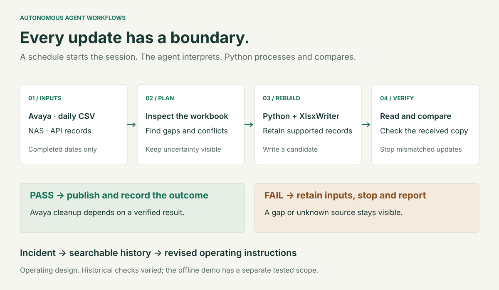
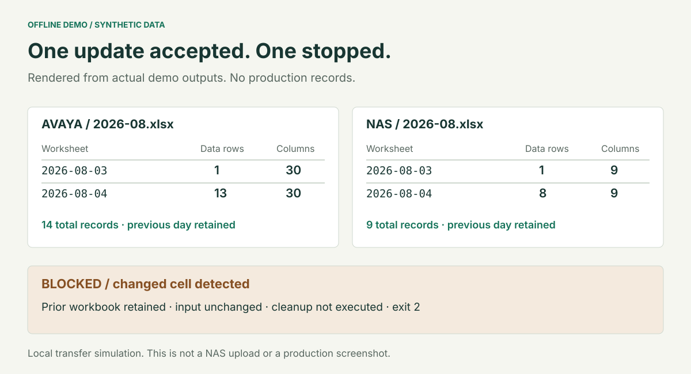

# Autonomous Agent Workflows

**English** · [繁體中文](README.zh-TW.md)

### Scheduled reporting and document updates, with clear operating boundaries

This repository covers three operational jobs: PBX call reporting, NAS access reporting and an eTMS document-update handoff. For the reporting jobs, I built workflows around Python processing, written operating procedures and Claude Cowork sessions. The work included handling incomplete inputs, preserving existing records, diagnosing failed runs and leaving a report someone could review.

The reporting case study follows those decisions through three operational incidents, with runnable synthetic examples of successful updates, repeat runs and validation failure. The eTMS case adds a different boundary: a scheduled agent hands file changes to a dedicated engine. A deployment review and a manually triggered shadow run show why the configuration, process exit and per-document result need separate checks.

[Try the offline demo](#try-it-locally) · [Read the case study](docs/case-study/01-context-and-role.md) · [Check the evidence](docs/evidence/README.md)



*The diagram describes the operating design. Historical checks varied by run; the public demo has its own explicit, tested scope.*

## Two reporting workflows

| | PBX call logs | NAS access logs |
|---|---|---|
| Source | Daily Avaya SMDR CSVs from a [Dockerised receiver](https://github.com/jackyngtf/smdr-receiver) | File-transfer records queried from the NAS API |
| Intended schedule | Weekdays, 10:00 | Weekdays, 09:00 |
| Output | Monthly workbook, with dated call-log sheets | Monthly workbook, with dated or grouped access-log sheets |
| Useful judgement | Reject malformed inputs, investigate authentication failures, identify safe recovery steps | Inspect missing coverage, diagnose API limits, report gaps that cannot be recovered |
| Processing | Python parses records and rebuilds tabular workbooks | Python groups dated records and rebuilds tabular workbooks |

The schedules describe configured routines in the historical record. They are not a claim of continuous operation or current uptime. [Follow both data paths →](docs/case-study/02-two-reporting-workflows.md)

## eTMS: a controlled document-update handoff

The third job's entry instructions specify **weekdays at 09:30**. It checks a document-update inbox and invokes a separate swap driver. The driver is assigned matching, planning, archiving, verification and outcome reporting; the agent is restricted to the engine's plan and must stop on failure or ambiguity.

The inspected configuration on **22 September 2026** was **shadow**. Source review confirmed that shadow skips production-document swaps but still performs inbox housekeeping and report uploads. Only the operator may enable live mode; database access, training-record changes and ad hoc manual swaps remain outside the agent's intended scope.

A user-triggered Cowork run reported **30 HELD, 0 PLANNED and 0 SWAPPED**. All 22 targets associated with missing-target messages were then found on the NAS through read-only checks. An offline reproduction supported the local-staging diagnosis; a private candidate passed isolated checks but is not deployed in this snapshot. Eight matching cases still require review. This is a held shadow result, not a successful live update. Scheduler timezone, successful live swaps and rollback remain unverified. The evidence is separate from the two runnable reporting demos and the 92-report ledger.

[Read the eTMS case](docs/case-study/07-etms-document-handoff.md) · [Check the deployment and run evidence](docs/evidence/etms-deployment-review-2026-09-22.md) · [Inspect the task contract](examples/etms-doc-swap/README.md)

## What the agent does, and what the code does

In the reporting jobs, the agent reads the operating procedure, inspects the current state, selects permitted actions and interprets unexpected results. Python handles record parsing, date handling, workbook generation and explicit checks. The eTMS contract delegates the write sequence to its external driver. A scheduled session makes a job recurring; the agent's role is the interpretation and exception handling within each job's boundaries.

Instructions are separated from searchable incident history. A useful finding can become a revised operating rule, with a record of why it changed. That is the project's **self-improvement loop**: maintaining operational knowledge, with no model training involved.

[Architecture and tradeoffs](docs/architecture.md) · [Runtime and scheduling](docs/how-it-runs-in-claude-code-cowork.md) · [Incident-to-instruction loop](docs/self-improvement-loop.md)

## Three incidents that changed the procedure

| What happened | What it taught me |
|---|---|
| A rebuilt NAS workbook contained duplicated headers, while a count check still passed | An expected value derived through the same faulty path is not an independent check. Compare against the original records. |
| Reading a large workbook exceeded an execution time limit | Change the serialization boundary, then check the resulting records. Treat a recorded runtime as one observation, not a benchmark. |
| The scheduled environment failed, and the destination later contained updates absent from local reports | Reinspect the actual destination before planning recovery. Keep manual recovery and updates of unknown origin visible. |

[Read the incidents and recovery decisions →](docs/case-study/04-incidents-and-recovery.md)

## What the available record supports

| Recorded item | Scope |
|---|---|
| 47 Avaya and 45 NAS run-report files | Local artifacts found during the 22 September 2026 review, excluding archived copies. Includes failures and recovery reports; not a count of successful unattended runs. |
| 313,721 NAS data rows in one rebuilt workbook | Reported on 3 August 2026. The report records a 23.6-second parse and a 22.8-second write; these are individual observations. |
| 40,179 NAS rows added across four sheets | Reported in the **manual/native Windows recovery** on 15 September 2026. Some older dates remained unavailable from the queried source. |
| 21 Avaya rows added, with seven prior sheets checked | Reported in the native recovery on 11 September 2026. |

These are report-derived outcomes, not an independent audit of the live NAS. The retained record does not establish uptime, a success rate, time saved or zero data loss.

[Operating record](docs/case-study/05-operating-record.md) · [Evidence and source boundaries](docs/evidence/README.md) · [Limitations](docs/case-study/06-lessons-and-limitations.md)

## Try it locally

Use Python 3.11 or later. Both reporting paths run offline with synthetic fixtures, without a NAS account, Claude session or API key. The eTMS integration is documented only; its private engine is not included in this command.

```bash
python -m pip install -r requirements.txt
python -m demo --workflow all --output-dir output/demo
python -m unittest discover -s tests -v
python scripts/check_docs.py
```

The first run creates an Avaya workbook and a NAS workbook under `output/demo`, plus a bilingual run report and machine-readable evidence. Run the same demo command again: it reports `NO_CHANGE` without rewriting an already matching workbook.

Then try a deliberately corrupted candidate:

```bash
python -m demo --workflow all --scenario blocked --output-dir output/blocked
```

**Exit code 2 is expected.** The demo detects the staged mismatch and blocks replacement of the existing workbook. The fictional inputs remain in place. This is a local simulation of the publication boundary; it does not upload to a NAS or delete source files.



[Watch the synthetic walkthrough](images/demo-walkthrough.webm?raw=true) · [Run the demo and checks](demo/README.md)

The recording opens a read-only viewer of the generated workbooks and the blocked-run evidence, with English and Traditional Chinese labels. It is an artifact walkthrough, not a recording of a live production agent.

## Read the case study

1. [The reporting problem and my role](docs/case-study/01-context-and-role.md)
2. [Two sources, two monthly workbooks](docs/case-study/02-two-reporting-workflows.md)
3. [What “verified” needs to mean](docs/case-study/03-integrity-and-verification.md)
4. [Failures, changes and recovery](docs/case-study/04-incidents-and-recovery.md)
5. [The operating record and its limits](docs/case-study/05-operating-record.md)
6. [What I would improve next](docs/case-study/06-lessons-and-limitations.md)
7. [eTMS: handing document changes to a constrained engine](docs/case-study/07-etms-document-handoff.md)

The [reference instructions](examples/README.md) explain the operational contracts. The [demo](demo/README.md) is the executable public reference. Neither is a ready-to-deploy replacement for the private environment.

## Public-copy boundaries

The repository contains authored case studies, sanitized source summaries, synthetic inputs and local demonstration code. It excludes production credentials, session state, raw company records and live integration adapters. Historical screenshots illustrate task configuration; they do not establish present-day scheduler health. [Media notes](images/README.md) · [Security and data boundaries](SECURITY.md)

The public code and documentation remain under the [MIT license](LICENSE).
