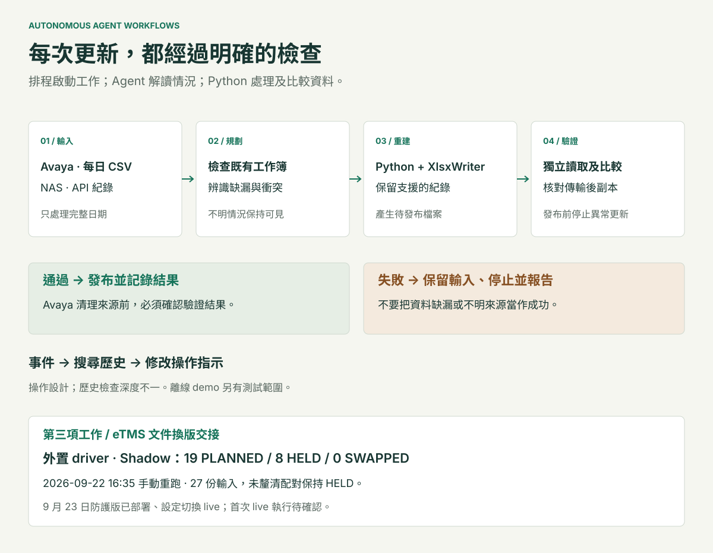
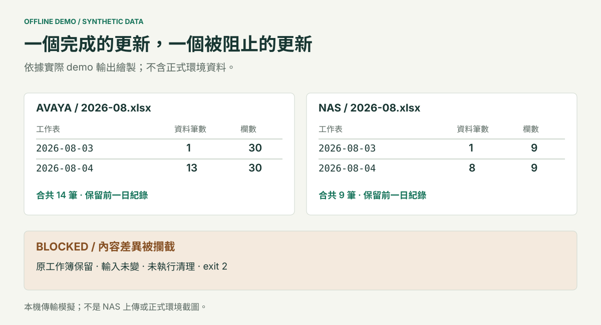

# Autonomous Agent Workflows

[English](README.md) · **繁體中文**

### 從每日紀錄到每月報表，每一步都有明確的檢查

PBX 通話紀錄及 NAS 檔案傳輸活動，需要定期整理成每月 Excel 報表。我以 Python 處理程式、書面操作程序及 Claude Cowork 執行工作階段，建立了兩個排程工作流程。工作內容包括處理不完整輸入、保留既有紀錄、診斷失敗原因，以及留下可供覆核的執行報告。

這份作品集透過三個實際營運事件，說明背後的設計決定；亦提供可執行的精簡參考版本，以虛構資料展示正常更新、重複執行及驗證失敗。

[執行離線示範](#在本機執行) · [閱讀案例](docs/case-study/01-context-and-role.zh-TW.md) · [查閱證據](docs/evidence/README.zh-TW.md)



*圖中呈現操作設計。歷史執行的檢查深度並不完全相同；公開示範另有明確的測試範圍。*

## 兩個流程，共同的報表需求

| | PBX 通話紀錄 | NAS 存取紀錄 |
|---|---|---|
| 資料來源 | [Docker 接收器](https://github.com/jackyngtf/smdr-receiver) 產生的每日 Avaya SMDR CSV | 從 NAS API 查詢的檔案傳輸紀錄 |
| 原定排程 | 平日 10:00 | 平日 09:00 |
| 輸出 | 按日期分頁的每月通話報表 | 按日期或日期組別分頁的每月存取報表 |
| 需要判斷的情況 | 拒絕格式異常輸入、調查認證失敗、選擇允許的恢復步驟 | 檢查缺漏日期、診斷 API 限制、報告無法補回的資料 |
| 資料處理 | Python 解析紀錄並重建表格式工作簿 | Python 按日期整理紀錄並重建表格式工作簿 |

以上時間是歷史紀錄中的設定，並不代表持續運作至今或目前的可用率。[查看兩條資料路徑 →](docs/case-study/02-two-reporting-workflows.zh-TW.md)

## Agent 與程式各自負責甚麼

Agent 讀取操作程序、檢查目前狀態、選擇允許的動作，並解讀異常結果。Python 負責紀錄解析、日期處理、工作簿產生及明確的檢查。排程讓流程定期啟動；Agent 的價值在於處理這些操作前後所需的判斷與例外情況。

操作指示與可搜尋的事件歷史分開保存。有用的發現可以整理成新的操作規則，並記錄修改原因。本專案的 **self-improvement loop** 指的是這種營運知識維護，並不涉及模型訓練。

[架構與取捨](docs/architecture.zh-TW.md) · [執行環境與排程](docs/how-it-runs-in-claude-code-cowork.zh-TW.md) · [從事件到操作指示](docs/self-improvement-loop.zh-TW.md)

## 三個改變操作程序的事件

| 發生了甚麼 | 帶來的設計經驗 |
|---|---|
| 重建的 NAS 工作簿出現重複標題列，但筆數檢查仍然通過 | 若預期值來自同一條有缺陷的處理路徑，就不算獨立檢查；必須對照原有紀錄。 |
| 讀取大型工作簿超出執行時間限制 | 調整序列化的單位，再檢查輸出紀錄；把單次執行時間視為觀察值，而非效能基準。 |
| 排程環境失敗，其後目的地卻出現本機報告未記載的更新 | 規劃恢復前先重新檢查目的地，清楚標示手動恢復及來源未明的更新。 |

[閱讀事件經過與恢復決定 →](docs/case-study/04-incidents-and-recovery.zh-TW.md)

## 現有紀錄支持哪些結果

| 記載項目 | 適用範圍 |
|---|---|
| Avaya 47 份、NAS 45 份執行報告檔案 | 2026 年 9 月 22 日檢視時找到的本機檔案，排除封存副本；包含失敗及恢復報告，並非成功無人值守執行次數。 |
| 一份重建 NAS 工作簿包含 313,721 筆資料 | 記載於 2026 年 8 月 3 日；報告記錄解析 23.6 秒、寫入 22.8 秒，均為單次觀察值。 |
| NAS 新增 40,179 筆資料、四個工作表 | 記載於 2026 年 9 月 15 日的**手動／原生 Windows 恢復**；部分較舊日期仍無法從當時查詢的來源取得。 |
| Avaya 新增 21 筆資料，並檢查七個既有工作表 | 記載於 2026 年 9 月 11 日的原生環境恢復。 |

以上結果來自執行報告，並非對即時 NAS 的獨立稽核。留存資料不足以證明可用率、成功率、節省工時或零資料損失。

[操作紀錄](docs/case-study/05-operating-record.zh-TW.md) · [證據與來源邊界](docs/evidence/README.zh-TW.md) · [已知限制](docs/case-study/06-lessons-and-limitations.zh-TW.md)

## 在本機執行

使用 Python 3.11 或以上版本。兩條示範路徑均使用合成資料，離線執行，毋須 NAS 帳戶、Claude 工作階段或 API key。

```bash
python -m pip install -r requirements.txt
python -m demo --workflow all --output-dir output/demo
python -m unittest discover -s tests -v
python scripts/check_docs.py
```

首次執行會在 `output/demo` 產生 Avaya 及 NAS 工作簿，另附雙語執行報告與機器可讀的驗證紀錄。再次執行相同示範指令，會回報 `NO_CHANGE`，不重寫已經相符的工作簿。

然後試一次故意修改待發布檔案的情境：

```bash
python -m demo --workflow all --scenario blocked --output-dir output/blocked
```

**預期結束代碼為 2。** 示範會發現待發布檔案不一致，阻止替換既有工作簿，並保留虛構輸入。這是在本機模擬發布前的檢查邊界，不會上傳至 NAS 或刪除來源檔案。



[觀看合成資料示範錄影](images/demo-walkthrough.webm?raw=true) · [執行示範與驗證](demo/README.zh-TW.md)

錄影透過唯讀檢視器，查看實際產生的工作簿及受阻執行證據，標籤包含英文及繁體中文。它展示的是輸出檔案，不是正式環境 Agent 的即時執行。

## 閱讀完整案例

1. [報表需求與我的角色](docs/case-study/01-context-and-role.zh-TW.md)
2. [兩個來源、兩份每月工作簿](docs/case-study/02-two-reporting-workflows.zh-TW.md)
3. [「已驗證」需要代表甚麼](docs/case-study/03-integrity-and-verification.zh-TW.md)
4. [失敗、修改與恢復](docs/case-study/04-incidents-and-recovery.zh-TW.md)
5. [操作紀錄及其限制](docs/case-study/05-operating-record.zh-TW.md)
6. [下一步會改善甚麼](docs/case-study/06-lessons-and-limitations.zh-TW.md)

[參考操作指示](examples/README.zh-TW.md) 說明流程規則；[示範程式](demo/README.zh-TW.md) 則是可執行的公開參考版本。兩者都不應直接取代私有環境中的正式部署。

## 公開版本的資料邊界

本 repo 包含重新編寫的案例、經整理的來源摘要、合成輸入及本機示範程式，不包含正式環境認證資料、工作階段狀態、公司原始紀錄或即時整合介面。歷史截圖用於說明排程設定，不能證明目前排程正常運作。[媒體說明](images/README.zh-TW.md) · [安全與資料邊界](SECURITY.zh-TW.md)

公開程式及文件沿用 [MIT 授權](LICENSE)。
