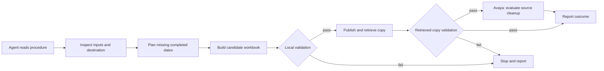

# Architecture: instructions, processing and evidence

[**English**](architecture.md) · [繁體中文](architecture.zh-TW.md)

The two reporting workflows combine a scheduled agent session, written operating procedures and Python processing. Their task is to add missing completed dates to monthly reports while preserving existing tabular records. The agent coordinates the work and handles exceptions; the scheduler starts the session.

The third job, [eTMS document updates](case-study/07-etms-document-handoff.md), delegates file planning and execution to an external driver. A [read-only deployment review on 22 September 2026](evidence/etms-deployment-review-2026-09-22.md) inspected the driver, engine and shadow configuration. The source skips production-document swaps in shadow but still performs inbox housekeeping and report uploads; a zero driver exit does not establish engine success. A separately assessed manual shadow report recorded 30 HELD and 0 SWAPPED; the offline-tested repair was later deployed with shadow configuration, and a later manual run reported 19 PLANNED, 8 HELD and 0 SWAPPED on a 27-input subset of the earlier 30. The workbook pipeline below applies only to the reporting jobs.

This describes the project's design. Historical scripts have different validation depths. The [offline demo](../demo/README.md) is a separate, strengthened local simulation, not evidence that every production run passed the same checks.

## Instructions and data have different roles

| Layer | Purpose | Read or changed when |
|---|---|---|
| `SKILL.md` | Entry instructions, working scope, procedure location and reporting requirements | Read at startup; revised when the entry contract changes |
| `WORKINSTRUCTION.md` | Current procedure, configuration references and handling rules | Read before processing; revised when an operational decision changes |
| `.learnings/` | Incidents, attempted fixes and unresolved questions | Searched for a relevant issue; new observations added after a run |

The intended pattern loads the current procedure and retrieves relevant historical entries. A matching error message is a lead, not an instruction: check the entry's date, environment and resolution before reusing its workaround.

Markdown was sufficient for this project's operational notes and avoided an additional retrieval service. No token-saving benchmark or comparison with a vector database was conducted. See [knowledge maintenance](self-improvement-loop.md).

## Processing and responsibility

The agent investigates unexpected responses and explains decisions. Deterministic code should parse schemas, calculate date eligibility, compare records and check outputs. The operator owns credentials, permissions, ambiguous data and changes to policy.

Written rules are behavioural constraints, not access controls. Shell access still permits operations beyond the procedure. A deployment needs suitable service permissions and a recovery process.

## What preservation and validation mean

Rebuilding creates a new file and may replace the remote workbook. The preservation target here is existing tabular records and the worksheet contract, not every formula, style, drawing, macro, link or XLSX package part.

| Check | What it establishes | What it cannot establish alone |
|---|---|---|
| Workbook opens | The library can parse the file | Correct records or complete source data |
| Names and row counts | Expected structure and size | Correct cell values or no duplicated headers |
| Expected-value comparison | Agreement with a separately prepared record snapshot | Upstream API completeness |
| Retrieved-copy comparison | Downloaded content matches the expected contract | Atomic upload, concurrent-writer safety or recovery of an earlier version |

A failed post-upload check blocks source cleanup but cannot undo an upload already performed. A live adapter also needs to distinguish confirmed file absence from unreadable files, and detect concurrent changes or enforce a single-writer constraint.

The public demo performs local record checks and simulates publication. It connects to no NAS, deletes no source files and reports cleanup eligibility only. The [reference examples](../examples/README.md) explain the live design; they are not a deployment package.

Related: [runtime](how-it-runs-in-claude-code-cowork.md) · [main portfolio](../README.md).
