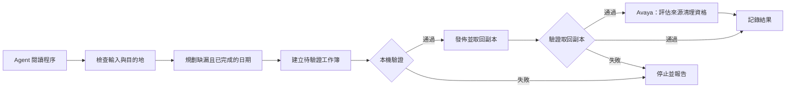

# 架構：操作指引、資料處理與證據

[English](architecture.md) · [**繁體中文**](architecture.zh-TW.md)

兩個報表流程結合排程啟動的 agent 工作階段、書面操作程序及 Python 資料處理。目的是在保留既有表格紀錄的前提下，將缺漏且已完成的日期加入月報。Agent 負責協調工作及處理例外；排程器負責啟動工作階段。

第三項工作 [eTMS 文件更新](case-study/07-etms-document-handoff.zh-TW.md)將檔案規劃與執行交給外置 driver。[附日期證據](evidence/etms-deployment-review-2026-09-22.zh-TW.md)記錄暫存失敗、修正測試，以及獲授權 live 執行的 19 SWAPPED、8 HELD 結果與其後唯讀檢查。Shadow 跳過正式文件替換，但仍處理收件區清理及上傳報告；driver 回傳零結束碼不代表 engine 成功。以下工作簿流程只適用於報表工作。

本文描述專案的設計。不同時期的程式，驗證深度並不一致。[離線示範](../demo/README.zh-TW.md)是另外整理並加強檢查的本機模擬，不能證明每次正式執行都通過相同檢查。

## 指引與資料的角色不同

| 層次 | 用途 | 讀取或修改時機 |
|---|---|---|
| `SKILL.md` | 入口指引、工作範圍、程序位置及報告要求 | 開始時閱讀；入口約定改變時修訂 |
| `WORKINSTRUCTION.md` | 現行程序、設定參照及處理規則 | 處理前閱讀；操作決策改變時修訂 |
| `.learnings/` | 事件、嘗試過的處理方法及未解決問題 | 按問題搜尋；執行後加入新觀察 |

預期的方式是載入現行程序，再查閱相關歷史。相同錯誤訊息是調查線索，不是操作指令：重新採用歷史處理方法前，應確認條目的日期、環境及解決狀態。

Markdown 足以處理本專案的操作筆記，也省去額外的檢索服務。專案沒有進行 token 節省量度或向量資料庫比較。詳見[知識維護](self-improvement-loop.zh-TW.md)。

## 處理流程與責任

Agent 調查非預期回應並解釋決策。確定性程式應負責解析資料結構、計算日期資格、比較紀錄及檢查輸出。操作負責人管理憑證、權限、含糊資料及政策變更。

文字規則是行為限制，不是存取控制。Shell 權限仍可能容許程序以外的操作。正式部署需要合適的服務權限及恢復程序。

## 保留與驗證的範圍

重建會產生新檔案，也可能替換遠端工作簿。這裡的保留目標是既有表格紀錄及工作表約定，不是每項公式、樣式、繪圖、巨集、連結或 XLSX 封裝部分。

| 檢查 | 可以證明的範圍 | 單靠這項檢查不能證明的範圍 |
|---|---|---|
| 工作簿可以開啟 | 套件能解析檔案 | 紀錄正確或來源完整 |
| 名稱與列數 | 結構及數量符合預期 | 儲存格正確或沒有重複標題列 |
| 預期值比較 | 與獨立準備的紀錄快照一致 | 上游 API 完整 |
| 取回副本比較 | 下載內容符合預期約定 | 原子上傳、並行寫入安全性或舊版本可恢復 |

上傳後驗證失敗，會阻止來源清理，但不能撤銷已完成的上傳。正式連接模組亦需要區分「已確認不存在」及「無法讀取」的檔案，並偵測並行修改，或明確限制為單一寫入者。

公開示範執行本機紀錄檢查並模擬發佈，不連接 NAS、不刪除來源，只報告清理資格。[參考範例](../examples/README.zh-TW.md)解釋正式流程的設計，並非部署套件。

相關文件：[執行環境](how-it-runs-in-claude-code-cowork.zh-TW.md) · [作品集主頁](../README.zh-TW.md)。
