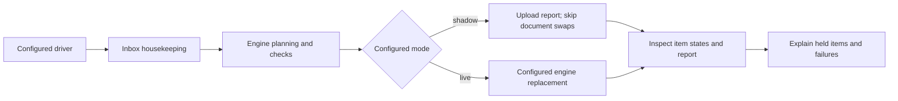

# 07 · eTMS: a held update exposes the handoff boundary

**English** · [繁體中文](07-etms-document-handoff.zh-TW.md) · [Project overview](../../README.md)

The eTMS job extends the portfolio from recurring reports to document maintenance. Its entry instructions describe a weekday 09:30 task that hands document updates to a separately deployed engine. The source does not specify the scheduler timezone, and the inspected materials do not establish engine authorship.

On 22 September 2026, read-only inspection confirmed the driver, engine and a shadow configuration. A user then manually triggered the Cowork task. The resulting report recorded **30 HELD, 0 PLANNED and 0 SWAPPED** against 30 inputs and a 509-entry manifest. This is a useful operational result because it exposes where processing stopped; it is not a successful document update.

## Delegate the write sequence

The intended design assigns matching, prechecks, replacement, archiving, verification and reporting to the driver and engine. The agent obtains the deployed package, respects its mode, invokes the driver and explains its result. If the package is absent, it must stop rather than substitute ad hoc file operations.

This diagram reflects the inspected source structure. In particular, inbox housekeeping occurs before the mode branch, and shadow uploads reports. Shadow skips production-document swaps; it does **not** mean no remote writes.

The manifest is derived from a static SQL snapshot file. That is a file input, not authority to connect to a database or execute SQL.

## The intended authority boundary

| Contract rule | Responsibility |
|---|---|
| No database or training-record changes | Document replacement does not update version fields, progress, completion, assignments or quizzes. |
| Engine-controlled file operations | The agent does not improvise swaps or repair database references. |
| Operator controls live mode | The agent cannot enable its own production-write mode. |
| Stop and report ambiguity or failure | A failed live write is not silently retried; a driver crash is reported with its known state. |

These are instruction-level rules. The deployment review evaluates code separately; it does not turn every written constraint into a technical guarantee.

## What the held run revealed

The Cowork summary described **22 target-missing cases and eight unmatched inputs**. Read-only checking then found **all 22 referenced target PDFs present on the NAS**, with no missing targets or read errors. A “missing target” message in this run therefore does not prove a missing production file or broken database reference.

Static review found a dependency in the initial planning sequence: the engine needs local destination files to plan, but the driver downloads destinations from the plan. An isolated reproduction confirmed that this sequence could hold an existing target. A private candidate stages the targets first and then validates; its synthetic test reached `PLANNED`, with PDF metadata mocked and transport blocked. That is not a claim that all 22 real inputs would now pass.

The matching follow-up retains exact-title checking. All eight cases still require review: three for renaming and five for manual review, including one with two candidates. Six integrated candidate tests and six separate matching tests passed. These were pre-deployment checks; the observed 15:27 result remains 30 held and zero swapped.

The outer driver also ignores the first engine subprocess return code and returns zero in shadow. A zero process exit cannot establish that a plan succeeded. The report's `HELD`, `ERROR` and `SWAPPED` states must be read at their own level; the observed run had 30 held items even though its `ERROR` and `PARTIAL` counts were zero.

Two retrieved reports had identical bytes and digest. They are not counted as two independent successful runs. Any “IT notified” text is retained only as report wording; separate notification dispatch was not verified.

## Evidence and remaining limits

The [dated deployment and run review](../evidence/etms-deployment-review-2026-09-22.md) records the source hashes, duplicate report digest, aggregates and metadata checks without publishing private document identifiers or locations.

At 16:22:42 +10:00 on 22 September 2026, the tested repair was deployed with verified backups and read-back hashes. Configuration remained shadow. The [deployment follow-up](../evidence/etms-deployment-review-2026-09-22.md#deployment-follow-up-22-september-2026) records the new hashes separately from the original inspected source. The user then manually reran Cowork at 16:35. Two reports for the same 27 inputs changed from 27 HELD to **19 PLANNED, 8 HELD and 0 SWAPPED**. These 27 inputs were a subset of the earlier 30; the reason for the three absences is not established. All eight held cases require document-identity review, and rename suggestions are not approvals. The [post-deployment report evidence](../evidence/etms-deployment-review-2026-09-22.md#post-deployment-shadow-run-22-september-2026) supports shadow planning outcomes, not live replacement, rollback or scheduler reliability.

A subsequent [static finding](../evidence/etms-deployment-review-2026-09-22.md#live-publication-limitation-found-after-the-shadow-run) identified a live-publisher parser that misses paths containing whitespace. It could skip upload checks while still reaching inbox cleanup after local swaps. The shadow result does not establish live readiness; a separate private guard candidate has passed nine offline test methods and is not deployed.

The eTMS evidence remains outside both the runnable Avaya/NAS demo and the 92-file reporting ledger.

[Task reference](../../examples/etms-doc-swap/README.md) · [Evidence guide](../evidence/README.md) · [Previous: lessons and limitations](06-lessons-and-limitations.md)
