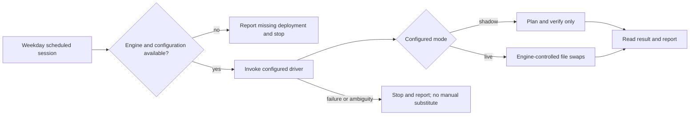

# 07 · eTMS: a constrained document-update handoff

**English** · [繁體中文](07-etms-document-handoff.zh-TW.md) · [Project overview](../../README.md)

The eTMS job extends the portfolio from recurring reports to document maintenance. Its entry instructions describe a weekday 09:30 task: inspect a drop-folder inbox and run a separately deployed engine to plan or perform document version swaps. The scheduler timezone is not specified in the inspected entry file.

The available evidence is the task contract. No engine, driver, configuration, tests or swap reports were found in the inspected local task materials. That does not establish whether an engine is deployed remotely. This chapter explains the documented responsibilities without claiming a verified production outcome.

## Delegate the write sequence

The scheduled agent is told to obtain `swap_engine.py`, `run_swap.py` and their configuration from the deployment location. If those artifacts are unavailable, it must report `ENGINE NOT DEPLOYED` and stop. When available, it invokes the driver and reads the resulting JSON and report.

The contract assigns inbox retrieval, manifest-based matching, prechecks, file swaps, archival, verification, logging and rollback to the driver. It mentions a manifest derived from an existing SQL snapshot file; that is distinct from authorizing a database connection. The engine implementation and these mechanisms were not inspected or exercised here.

## Permission is narrower than file-system access

| Boundary in the entry contract | Practical implication |
|---|---|
| No database access or SQL execution | The task does not update application records through a database client. |
| No training, progress, completion, assignment or quiz changes | Document replacement does not decide whether users require retraining. |
| Writes only through the engine's swap plan | Planned files, version archives and designated logs/reports are the permitted output classes. |
| Operator controls shadow-to-live transition | The agent cannot enable its own production-write mode. |
| Stop on failure or ambiguity | No ad hoc swap, unreported retry of a failed live write or attempted database repair. |

These are written constraints. They require enforcement in engine code and service permissions before they can be treated as technical guarantees.

## Shadow and live mean different outcomes

Shadow mode is specified as planning and verification without production writes. Live mode permits configured swaps through the driver. The entry file says shadow remains the mode until IT changes it; the actual current configuration was not available, so the portfolio does not assert a current mode.

The agent's report must distinguish `PLANNED`, `SWAPPED` and `HELD`, explain held items, flag path or engine anomalies, and identify changed files and archived versions after a live operation. A driver crash requires a report of the last reached state, not a manual attempt to finish the swap.

## What would establish an implementation result

Useful additional evidence would include a sanitized engine interface, a reviewed configuration schema, synthetic matching/ambiguity tests, injected-failure rollback tests, and dated shadow/live reports. Until that evidence is available, this remains a documented scheduled integration contract, separate from the runnable Avaya/NAS reference and the report-artifact ledger.

[Task reference](../../examples/etms-doc-swap/README.md) · [Evidence guide](../evidence/README.md) · [Previous: lessons and limitations](06-lessons-and-limitations.md)
