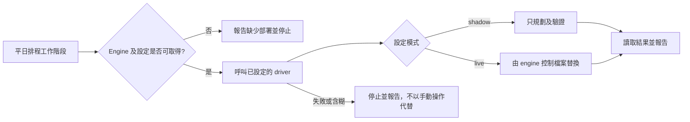

# 07 · eTMS：受限制的文件換版交接

[English](07-etms-document-handoff.md) · **繁體中文** · [作品集主頁](../../README.zh-TW.md)

eTMS 工作把作品集的範圍由定期報表延伸至文件維護。入口指示描述一項平日 09:30 的排程：檢查文件收件區，透過獨立部署的 engine 規劃或執行文件版本替換。已檢視的入口檔案沒有指定排程時區。

目前可取得的證據是工作約定。在已檢視的本機材料中，沒有找到 engine、driver、設定、測試或換版報告；這並不能證明遠端是否已部署 engine。本章說明文件中規定的責任，不把它當作已驗證的正式執行結果。

## 把寫入程序交給 driver

排程 Agent 需要從部署位置取得 `swap_engine.py`、`run_swap.py` 及設定。若檔案不存在，必須回報 `ENGINE NOT DEPLOYED` 並停止；取得檔案後，才呼叫 driver，讀取輸出的 JSON 及報告。

約定將收件區讀取、依 manifest 配對、事前檢查、換檔、封存、驗證、記錄及回復交給 driver。來源提及從既有 SQL 快照檔產生 manifest；這與允許連接資料庫是不同的事。本次沒有檢視或執行 engine，不能確認以上機制的實作。

## 允許範圍比檔案系統權限更窄

| 入口約定的邊界 | 實際含義 |
|---|---|
| 不存取資料庫或執行 SQL | 不透過資料庫客戶端修改應用程式紀錄。 |
| 不修改訓練、進度、完成、指派或測驗資料 | 文件替換不會自行決定使用者是否需要重新受訓。 |
| 所有寫入必須經 engine 的 swap plan | 允許的輸出類別限於計劃中的檔案、版本封存及指定日誌／報告。 |
| 由操作負責人切換 shadow 至 live | Agent 不能自行啟用正式環境寫入模式。 |
| 遇到失敗或含糊情況必須停止 | 不臨時手動換檔、不在未報告下重試失敗的 live 寫入，也不嘗試修復資料庫。 |

以上是書面限制，需要 engine 程式與服務權限實際執行，才能視為技術保證。

## Shadow 與 live 代表不同結果

Shadow 模式規定只作規劃及驗證，不寫入正式環境；live 模式才允許 driver 執行設定中的換檔。入口檔案寫明由 IT 將 shadow 切換至 live，但本次未取得實際設定，因此作品集不聲稱目前正在使用哪個模式。

Agent 的報告必須區分 `PLANNED`、`SWAPPED`、`HELD`，解釋擱置原因，列出路徑或 engine 異常，並在 live 操作後指出已修改檔案及封存版本。若 driver 崩潰，應報告最後到達的狀態，而非手動嘗試完成替換。

## 哪些證據可以支持實作結果

下一步可加入經整理的 engine 介面、已覆核的設定結構、合成資料配對／含糊情境測試、故障注入回復測試，以及附日期的 shadow／live 報告。在取得這些證據前，這部分保持為已有文件記載的排程整合約定，與可執行的 Avaya／NAS 參考版本及報告檔案清單分開。

[排程參考](../../examples/etms-doc-swap/README.zh-TW.md) · [證據說明](../evidence/README.zh-TW.md) · [上一章：經驗與限制](06-lessons-and-limitations.zh-TW.md)
